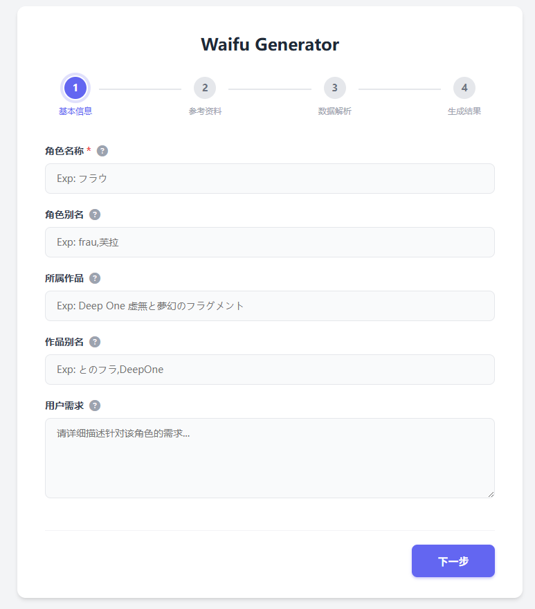
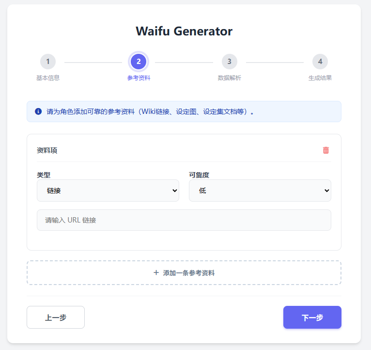

# Waifu Generator

一个SillyTavern角色卡快速生成工具

  



## 部署

### 1.安装依赖
```
pip install -r requirements.txt
```
### 2.修改配置文件
打开[config.json](config.json)  

可选：

链接读取功能需要jina的apikey，可以在[这里](https://jina.ai/reader/)免费获得  

图片反推使用的deepdanbooru，在[这里](http://dev.kanotype.net:8003/deepdanbooru/)获得cookie  

深度搜索使用的google的deep-research-pro-preview-12-2025作为agent，你需要一个GEMINIkey，timeout超时时间单位为min  

必选：

生成人物卡的大语言模型，目前仅支持openai格式的接口

### 3.启动

```
python backend/main.py
```

然后在浏览器打开 http://127.0.0.1:9986/
